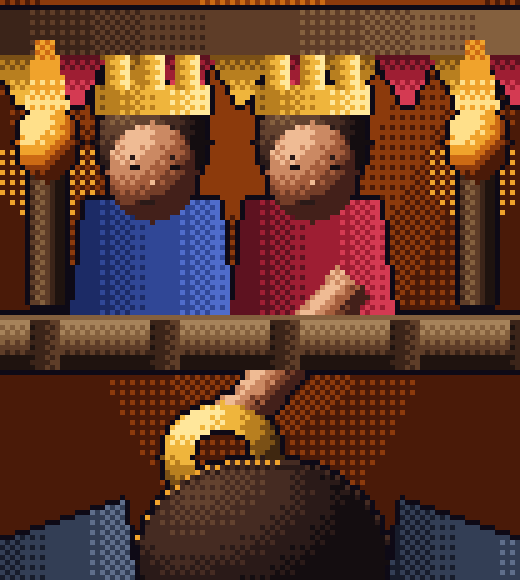
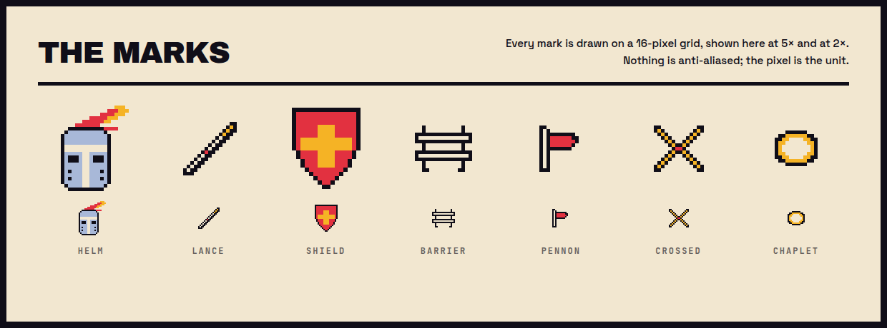

<p align="center">
  
</p>

<p align="center">
  <strong>Give Joust a competition. It reads the rules, picks a way to win, builds a real
  entry, tests it, repairs its own failures, publishes the result, and keeps improving it
  until the deadline.</strong>
</p>

<p align="center">
  
</p>

Joust is an agent that runs on Plow, and it is evidence-first: nothing reports
success on a claim, only on a result it observed. A build passes because a
recorded run exited zero. A branch is pushed because the remote SHA was read
back and matched. Whatever Joust cannot observe stays unverified rather than
becoming a pass.

## Run it

You need Git, Docker and Docker Compose v2.

```bash
git clone https://github.com/baskpascal/joust.git && cd joust
```

Mint a Plow credential with the official helper — it writes `./plow-credentials`,
which holds an API token, so keep it local and out of Git:

```bash
git clone https://github.com/plow-pbc/plow-agents.git
export PATH="$PWD/plow-agents/bin:$PATH"
plow-agents login && plow-agents lines && plow-agents mint <free-line-id>
```

Pick a stable Agent Index id, set `AGENT_ID` to it, and start:

```bash
AGENT_ID=your-agent-id docker compose up --build -d
```

Then talk to it in Plow Chat. Send a competition URL and `Joust it.`

```bash
python -m hackathon_competitor.cli doctor   # every runtime surface, one report
```

<details>
<summary>Windows PowerShell, a standalone image build, and credential paths</summary>

```powershell
$env:AGENT_ID = "your-agent-id"
docker compose up --build -d
```

`docker build -t joust-agent .` builds the image on its own. `AGENT_ID` is
yours to choose, is not the product name, and must not change across restarts.
If your checkout sits on a filesystem that cannot hold POSIX modes — a Windows
drive mounted under WSL, say — keep the credential somewhere that can and point
`PLOW_CREDENTIALS_PATH` at it.

</details>

## What it does

Joust owns a mission, not a codebase, so publishing a submission does not end
the run:

```text
observe → assess → strategize → execute → verify → measure → adapt ─┐
   ^                                                                │
   └────────────────────────────────────────────────────────────────┘
```

Every remote mutation — pushing, opening a pull request, deploying, submitting —
takes one path: a durable proposal, an approval decision, an idempotent
execution, an observation of the actual remote state, and evidence.

An action waiting on somebody else rests in `AWAITING_EXTERNAL`, which is
neither success nor failure. A source that could not be read is recorded as
unreadable, never as unchanged.

<table>
<tr>
<td width="50%" valign="top">
  
  <p align="center"><em>Winning is an event, not the end of the mission.</em></p>
</td>
<td width="50%" valign="top">
  
  <p align="center"><em>Every claim carries something that vouches for it.</em></p>
</td>
</tr>
</table>

## The marks

<p align="center">
  
</p>

Per pale crimson and azure, a lance in pale gold. Every mark is drawn on a
16-pixel grid, and the scenes are shaded from five-step colour ramps with one
light direction and ordered dithering. None of it is hand-exported:

```bash
python docs/brand/build_marks.py    # redraws every artboard and scene
node docs/brand/render_marks.mjs    # captures the hero, card and mark sheet
```

## Read more

[The design document](docs/SDD.md) says what Joust is meant to be.
[The runbook](docs/RUNBOOK.md) says how to operate it.
[The build notes](docs/BUILD_NOTES.md) say why each piece came out the way it did.

`python -m hackathon_competitor.cli bundle` writes a reproducible archive of the
committed files and refuses to produce one that is missing the install files or
the MIT licence, or that carries credentials, databases or bytecode.

MIT licensed.
