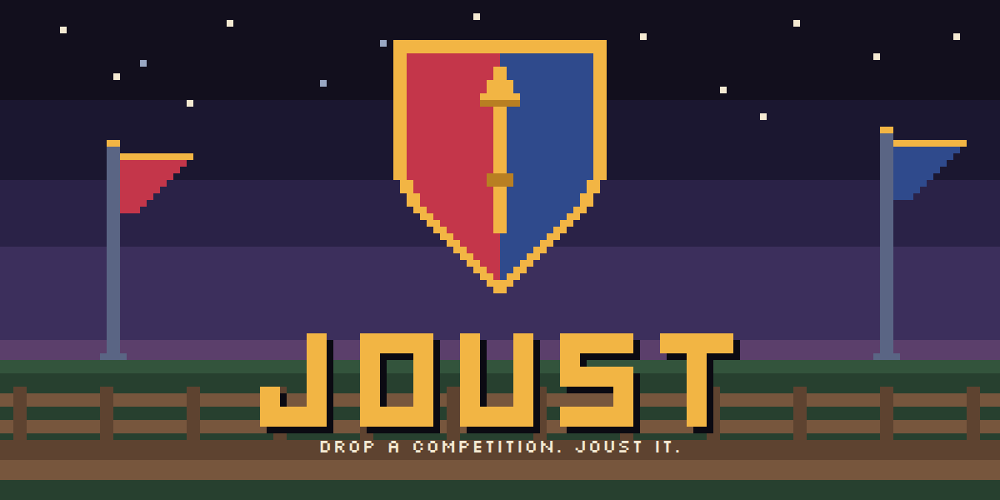

<p align="center">
  
</p>

Give Joust a competition. It reads the rules, picks a way to win, builds a real
entry, tests it, diagnoses its own failures and repairs them, publishes the
result, then keeps watching the competition and improving until the deadline.

```text
https://some-competition.example

Joust it.
```

Joust is a Hermes agent that runs on Plow. It is **evidence-first**: no step
reports success on a claim, only on an observed result. A build passes because
a recorded `BuildRun` exited zero; a branch is pushed because the remote SHA was
read back and matched; an agent is Verified because the public record says so.
Anything Joust cannot observe stays `UNVERIFIED` rather than becoming a pass.

## The compete loop

A Mission is the root object, not a codebase. It keeps running after a
submission is published, because publishing is an event in a competition, not
the end of one.

```text
observe → assess → strategize → execute → verify → measure → adapt ─┐
   ^                                                                │
   └────────────────────────────────────────────────────────────────┘
```

The loop ends only when the mission is completed, expired, stopped by its
operator, or irrecoverably blocked.

## What is actually wired

| Capability | State |
| --- | --- |
| Competition research into versioned rules and signals | live, with source evidence and supersession |
| Real target repository, mission branch, change sets | live, separate from Joust's own repository |
| Build, test, failure analysis, automatic repair, commit | live, reproduced from a clean clone |
| Authenticated GitHub observation and mutation | live: repository creation, push, and pull request |
| Agent Index metrics, metadata, verification, submission | live reads; writes behind the approval contract |
| Hosted deployment | prepared as an approval-bound handoff |

Every remote mutation takes the same path, and none of it can shortcut to
success:

```text
proposal → approval policy → idempotent execution → remote observation → evidence
```

An action waiting on somebody else rests in `AWAITING_EXTERNAL`, which is
neither success nor failure. A source that could not be read is recorded as
unreadable, never as unchanged.

## Run it on Plow

Requirements: Git, Docker, and Docker Compose v2. A standalone image build is
optional:

```bash
docker build -t joust-agent .
```

1. Mint a line-scoped credential with the official helper:

   ```bash
   git clone https://github.com/plow-pbc/plow-agents.git
   export PATH="$PWD/plow-agents/bin:$PATH"
   plow-agents login
   # send the printed activation phrase by SMS/iMessage, then:
   plow-agents lines
   plow-agents mint <free-line-id>
   ```

   `mint` writes `./plow-credentials`. It holds a Plow API token: keep it local,
   readable only by you, and out of Git and the Docker build context, where it
   is already excluded.

2. Choose a stable Agent Index id and set `AGENT_ID` to it. It is an
   operator-chosen identifier that Plow does not supply, it is not the product
   name, and it must not change across restarts or re-registration.

3. Start it:

   ```bash
   AGENT_ID=your-agent-id docker compose up --build -d
   ```

   ```powershell
   $env:AGENT_ID = "your-agent-id"
   docker compose up --build -d
   ```

   `.env.example` carries the same non-secret defaults if you prefer a `.env`.
   Never put the minted credential in it. Where a checkout cannot hold POSIX
   modes — a Windows drive mounted under WSL, for instance — keep the credential
   on a filesystem that can and point `PLOW_CREDENTIALS_PATH` at it.

The image runs the official Agent Index client, pinned by commit and SHA-256,
under `s6` every five minutes. It reports day and model token counts. Prompts,
mission content, credentials and file paths are never sent.

## Working on it

Requirements: Python 3.11+ and Pydantic 2.x.

```bash
python -m hackathon_competitor.cli doctor
python -m hackathon_competitor.cli mission create --url <competition-url>
python -m hackathon_competitor.cli mission attach-project <mission-id> \
  --path <project-dir> --mode existing_repo \
  --test-command '["python","-m","pytest","-q"]'
python -m hackathon_competitor.cli mission build-project <mission-id> --hermes --max-repairs 1
python -m hackathon_competitor.cli mission index-eligibility <mission-id> --agent <agent-id>
```

`attach-project` keeps the competition source and the entry repository as
separate mission objects; Joust's own repository is never implicitly the
target. Build, test and install commands are explicit JSON argv lists, executed
without shell expansion, and project subprocesses get a reduced, non-secret
environment. `build-project` works on a mission branch, records the commit and
the logs, and repeats the checks from a clean clone. It never pushes and never
opens a pull request: those go through the approval-bound publication service.

`just test`, `just lint`, `just doctor` and `just bundle` wrap the same things.
`HACKATHON_COMPETITOR_HOME` overrides the local state directory.

## Marks

<p align="center">
  
</p>

Per pale crimson and azure, a lance in pale gold. Every mark is drawn on a
16-pixel grid and keeps its shape down to a favicon. The art is generated rather
than hand-exported, so it is reproducible like everything else here:

```bash
python docs/brand/build_marks.py    # redraws the artboards from the pixel maps
node docs/brand/render_marks.mjs    # captures the PNGs (needs a Chromium)
```

## Reading further

[docs/SDD.md](docs/SDD.md) is the design document.
[docs/JOUST_ARCHITECTURE_DELTA.md](docs/JOUST_ARCHITECTURE_DELTA.md) tracks what
is built against it, [docs/BUILD_NOTES.md](docs/BUILD_NOTES.md) records why each
piece came out the way it did, and [docs/RUNBOOK.md](docs/RUNBOOK.md) and
[docs/DECISIONS.md](docs/DECISIONS.md) cover operation and the calls made along
the way.

Create a reproducible public archive from committed files:

```bash
python -m hackathon_competitor.cli bundle --output dist/joust-public.zip
```

It refuses to produce one that is missing the install files or the MIT licence,
or that carries credentials, databases, bytecode or internal review notes, and
returns the archive's SHA-256.

MIT licensed.
